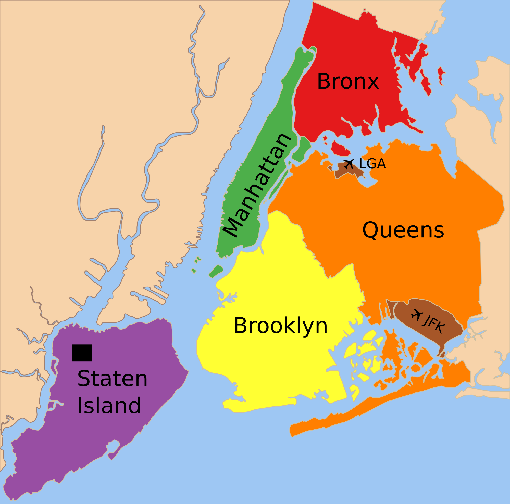

<h5 style="text-align: center;" markdown="1">By: Shiwei Chen (sc4935)  |  Shiyin Li (sl5010)  |  Weize Sun (ws2646)  |  Wenyu Zhang (wz2591)  |  Yiming Li (yl4925)</h5>

<h1><b>
Introduction
</b></h1>

<left>
<iframe width="840" height="472" src="https://www.youtube.com/embed/JU3zgP7J7BU" frameborder="0" allow="accelerometer; autoplay; clipboard-write; encrypted-media; gyroscope; picture-in-picture" allowfullscreen></iframe>
</left>

  In the 1980s, New York was one of the most crime-ridden cities in the United States. From the 1990s to the 2010s, the crime rate of NYC dropped sharply. Nowadays, NYC has become one of the lowest crime rates of major cities in the US.

  As the brand new residents of NYC, we would like to explore the security situation and stability of this city. In addition, analyzing crime data from NYPD might raise the safety awareness of the victim population as well as other citizens and visitors, thus they can avoid high-crime areas.
Finally, our project also could provide housing and daily travel advice to our classmates and alumni.

## Questions
We raised four questions to answer:

1. Is there any correlation between level of offensive and age, time, borough, race, or gender?

2. Is the difference among crime distribution of the five boroughs statistically significant?

3. For each day of a week, is the crime distribution of the five boroughs the same?

4. Generally, which borough is the safest one among the five?

## About us

We are all Chinese students and studying in Biostatistics MS program in Columbia University Mailman School of Public Health.

### Link to our personal website

[Shiwei Chen](https://gic94.github.io/)

[Shiyin Li](https://shiyin-li-fiona.github.io/p8150_sl5010.github.io/)

[Weize Sun](https://ws2646.github.io/)

[Wenyu Zhang](https://wenyuzhang77.github.io)

[Yiming Li](https://chongchongknight.github.io/)
